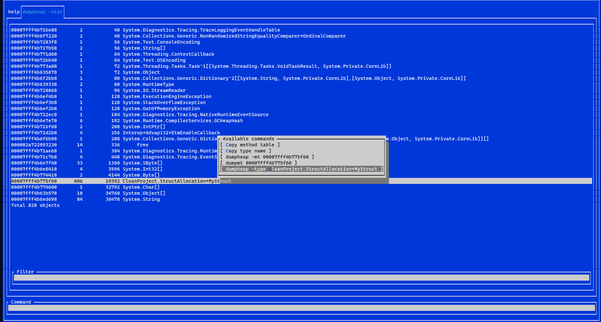

# PoshDotnetDumpAnalyzeViewer
This is a small gui.cs based ui to work with dotnet dump analyze

It's able to list output of all supported SOS commands and additionally custom parsers providing contextual subcommands like this:




```powershell
    Install-Module -Name PoshDotnetDumpAnalyzeViewerModule
    Get-DotnetDumpAnalyzeViewer "path-to-dump-file"
```

Note that this viewer is completely dependent on dotnet-dump and it does not bundle sos or anything like that.

Command field:
- Enter -> invoke command or get already existing tab
- Ctrl + Enter -> invoke command and refresh existing tab (if it exist) 

Tabs:
- Ctrl + W -> close tab (help is not closeable)
- Ctrl + R -> refresh tab (invoke command again, failed commands are not refreshable)

List view:
- Enter -> invoke custom action or get subcommands view
- Tab -> find next item using text from filter field

Filter field:
- Enter -> filter items in list view 
- Tab -> find next item in list view and focus it

Subcommands dialog:
- Enter -> execute subcommand
- Tab -> copy subcommand's command string into command field (might be useful when you want to invoke command with custom flags)

Currently implemented custom parsers:

- [x] dumpheap <arguments>                       Displays info about the garbage-collected heap and collection statistics about objects.
- [x] help <command>                             Display help for a command.
- [x] setthread, threads <thread>                Displays threads or sets the current thread.
- [x] exit, q, quit                              Exit interactive mode.

There are many other commands that might have contextual subcommands so need to make more parsers. Any help is welcome!
Not all of them can be parsed into something useful tho. Need more investigation.

Examples of possbily not parseable commands:
setsymbolserver, logging

- [] d, readmemory
- [] db <address>                               Dump memory as bytes.
- [] dc <address>                               Dump memory as chars.
- [] da <address>                               Dump memory as zero-terminated byte strings.
- [] du <address>                               Dump memory as zero-terminated char strings.
- [] dw <address>                               Dump memory as words (ushort).
- [] dd <address>                               Dump memory as dwords (uint).
- [] dp <address>                               Dump memory as pointers.
- [] dq <address>                               Dump memory as qwords (ulong).
- [] clrmodules                                 Lists the managed modules in the process.
- [] dcd, dumpconcurrentdictionary <address>    Display concurrent dictionary content.
- [] dcq, dumpconcurrentqueue <address>         Display concurrent queue content.
- [] dg, dumpgen <generation>                   Displays heap content for the specified generation.
- [] logging                                    Enable/disable internal logging
- [] lm, modules                                Displays the native modules in the process.
- [] r, registers                               Displays the thread's registers.
- [] runtimes                                   List the runtimes in the target or change the default runtime.
- [] setclrpath <path>                          Set the path to load coreclr DAC/DBI files.
- [] sosstatus                                  Display internal status or reset the internal cached state.
- [] parallelstacks, pstacks                    Display merged threads stack a la Visual Studio 'Parallel Stacks' panel.
- [] taskstate, tks <address>                   Display a Task state in a human readable format.
- [] threadpoolqueue, tpq                       Display queued ThreadPool work items.
- [] ti, timerinfo                              Display running timers details.
- [] clrstack <arguments>                       Provides a stack trace of managed code only.
- [] clrthreads <arguments>                     List the managed threads running.
- [] dbgout <arguments>                         Enable/disable (-off) internal SOS logging.
- [] dumpalc <arguments>                        Displays details about a collectible AssemblyLoadContext into which the specified object is loaded.
- [] dumparray <arguments>                      Displays details about a managed array.
- [] dumpasync <arguments>                      Displays info about async state machines on the garbage-collected heap.
- [] dumpassembly <arguments>                   Displays details about an assembly.
- [] dumpclass <arguments>                      Displays information about a EE class structure at the specified address.
- [] dumpdelegate <arguments>                   Displays information about a delegate.
- [] dumpdomain <arguments>                     Displays information all the AppDomains and all assemblies within the domains.
- [] dumpheap <arguments>                       Displays info about the garbage-collected heap and collection statistics about objects.
- [] dumpil <arguments>                         Displays the Microsoft intermediate language (MSIL) that is associated with a managed method.
- [] dumplog <arguments>                        Writes the contents of an in-memory stress log to the specified file.
- [] dumpmd <arguments>                         Displays information about a MethodDesc structure at the specified address.
- [] dumpmodule <arguments>                     Displays information about a EE module structure at the specified address.
- [] dumpmt <arguments>                         Displays information about a method table at the specified address.
- [] do, dumpobj <arguments>                    Displays info about an object at the specified address.
- [] dumpvc <arguments>                         Displays info about the fields of a value class.
- [] dso, dumpstackobjects <arguments>          Displays all managed objects found within the bounds of the current stack.
- [] eeheap <arguments>                         Displays info about process memory consumed by internal runtime data structures.
- [] eeversion <arguments>                      Displays information about the runtime version.
- [] finalizequeue <arguments>                  Displays all objects registered for finalization.
- [] gcwhere <arguments>                        Displays the location in the GC heap of the argument passed in.
- [] ip2md <arguments>                          Displays the MethodDesc structure at the specified address in code that has been JIT-compiled.
- [] name2ee <arguments>                        Displays the MethodTable structure and EEClass structure for the specified type or method in the specified module.
- [] pe, printexception <arguments>             Displays and formats fields of any object derived from the Exception class at the specified address.
- [] syncblk <arguments>                        Displays the SyncBlock holder info.
- [] histclear <arguments>                      Releases any resources used by the family of Hist commands.
- [] histinit <arguments>                       Initializes the SOS structures from the stress log saved in the debuggee.
- [] histobj <arguments>                        Examines all stress log relocation records and displays the chain of garbage collection relocations that may have led to the address passed in as an argument.
- [] histobjfind <arguments>                    Displays all the log entries that reference an object at the specified address.
- [] histroot <arguments>                       Displays information related to both promotions and relocations of the specified root.
- [] setsymbolserver <arguments>                Enables the symbol server support.
- [] verifyheap <arguments>                     Checks the GC heap for signs of corruption.
- [] threadpool <arguments>                     Lists basic information about the thread pool.
- [] soshelp <arguments>                        Displays help for a specific SOS command.
- [] dumprcw <arguments>                        Displays information about a Runtime Callable Wrapper.
- [] dumpccw <arguments>                        Displays information about a COM Callable Wrapper.
- [] dumppermissionset <arguments>              Displays a PermissionSet object (debug build only).
- [] traverseheap <arguments>                   Writes out a file in a format understood by the CLR Profiler.
- [] analyzeoom <arguments>                     Displays the info of the last OOM occurred on an allocation request to the GC heap.
- [] verifyobj <arguments>                      Checks the object for signs of corruption.
- [] listnearobj <arguments>                    Displays the object preceding and succeeding the address specified.
- [] gcheapstat <arguments>                     Display various GC heap stats.
- [] watsonbuckets <arguments>                  Displays the Watson buckets.
- [] comstate <arguments>                       Lists the COM apartment model for each thread.
- [] gchandles <arguments>                      Provides statistics about GCHandles in the process.
- [] objsize <arguments>                        Lists the sizes of the all the objects found on managed threads.
- [] gchandleleaks <arguments>                  Helps in tracking down GCHandle leaks